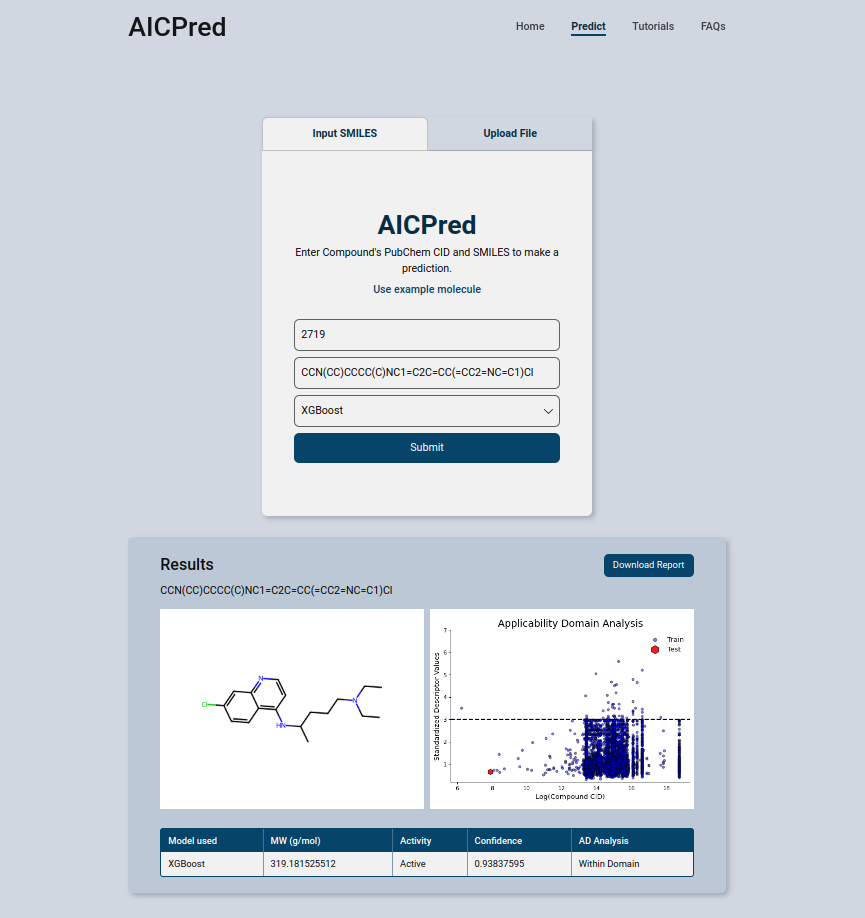

# StormPred

An AI powered web application for predicting potential anti-inflammatory compounds against the toll-like receptor 4 (TLR4) to ameliorate the Covid-19 induced cytokine storm.


<p style="text-align:center;">The home page of the web application<p>

**Dependencies**  

* Python 3.8+
* Flask

**To run locally**

1. Clone the repository
2. Navigate into the directory 
3. Install the requirements using `pip install -r requirements.txt`
4. Run the app using `python run.py`
5. Close the app using `Ctrl + C`

**To make a prediction**
1. Navigate to the app in your browser
2. Input the molecule ID (PubChem ID) of the molecule you want to predict
3. Input the SMILES string of the molecule you want to predict
4. Click the predict button
5. Scroll down to see the prediction

**Alternatively, you can upload a text file**
1. Navigate to the app in your browser
2. Click on the `to upload a text file instead` link
3. Upload a text file containing the molecule IDs (PubChem IDs) and the SMILES string of the molecules you want to predict in the format shown below
```
1983 CC(=O)NC1=CC=C(C=C1)O


```


<p style="text-align:center;">The prediction page of the web application<p>
