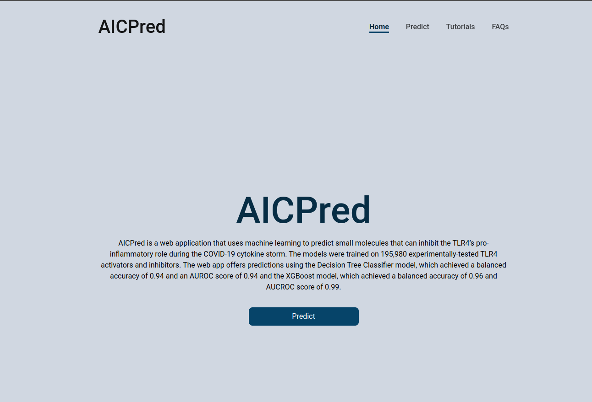

# AICPred

## About

### Background 
The cytokine storm (CS) is a major cause of the poor prognosis of COVID-19 cases. This condition is characterized by an exaggerated production of pro-inflammatory cytokines in the body which leads to multiple organ failure and eventually death in severely ill COVID-19 patients. The Toll-like Receptor 4 (TLR4) has been implicated in the COVID-19-induced CS. Studies have shown that the SARS-CoV-2 spike protein interacts with TLR4 to induce an exaggerated production of pro-inflammatory cytokines, leading to hyperinflammation and severe multi-organ damage. This study employed machine learning algorithms for the development of predictive models for the identification of potential TLR4 inhibitors.

### Methods 
Machine learning models (Random Forest, Adaptive Boosting, eXtreme Gradient Boosting, k-Nearest Neighbor, and Decision Trees) developed for the prediction of inhibitors of TLR4 activity. Data resampling techniques such as Random Undersampling, Synthetic Minority Oversampling Technique, and the random selection of 5000 majority class instances were used to handle the class imbalance within the training data. The performance of the models was evaluated with a 10-fold cross-validation strategy based on accuracy, balanced accuracy, recall, F1 score, precision, and Matthew’s Correlation Coefficient (MCC). The models were tested on held-out data and further validated with experimentally determined inhibitors of TLR4.

### Results 
The XGBoost algorithm produced the best-performing models yielding accuracies above 0.99, balanced accuracies above 0.90, and AUROC scores above 0.92. XGBoost and AdaBoost models were also able to predict all experimentally validated inhibitors of TLR4 as active with confidence ranging from 0.72 to 1.00. 

### Significance 
The developed models constitute an effort in the discovery of therapeutics against the COVID-19-induced cytokine storm which contributes to the poor prognosis of the disease. These models can also be utilized for prospects of drug repurposing against diseases for which the Toll-like receptor 4 is a viable target.
Keywords: Cytokine Storm, COVID-19, Toll-like Receptor 4 (TLR4), Machine learning.

### Web Server
An AI powered web application for predicting potential anti-inflammatory compounds against the toll-like receptor 4 (TLR4) to ameliorate the Covid-19 induced cytokine storm.


<p style="text-align:center;">The home page of the web application<p>

**Dependencies**  

* Python 3.8+
* Flask

**To run locally**

1. Clone the repository
2. Navigate into the directory 
3. Install the requirements using `pip install -r requirements.txt`
4. Run the app using `python run.py`
5. Close the app using `Ctrl + C`

**To make a prediction**
1. Navigate to the app in your browser
2. Input the molecule ID (PubChem ID) of the molecule you want to predict
3. Input the SMILES string of the molecule you want to predict
4. Click the predict button
5. Scroll down to see the prediction

**Alternatively, you can upload a text file**
1. Navigate to the app in your browser
2. Click on the `to upload a text file instead` link
3. Upload a text file containing the molecule IDs (PubChem IDs) and the SMILES string of the molecules you want to predict in the format shown below
```
1983 CC(=O)NC1=CC=C(C=C1)O


```


<p style="text-align:center;">The prediction page of the web application<p>
